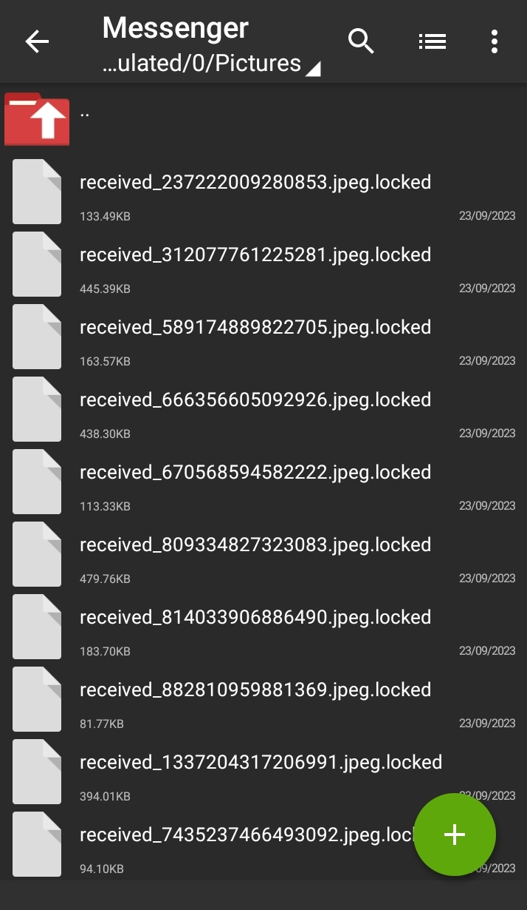

## Ransomware Proof of Concept

This repository houses an educational ransomware proof of concept designed for research and educational purposes. This project provides insights into how ransomware operates using [Termux](https://en.wikipedia.org/wiki/Termux) application only.


## Features

1. **AES Encryption**: The script uses [AES-256](https://en.wikipedia.org/wiki/Advanced_Encryption_Standard) algorithm to encrypt files.

2. **File Deletion**: Empty and original files are removed during encryption.

3. **File Processing**: It processes files in specified directories, encrypting or decrypting them.


## How It Works
This code operates as follows:


1. **AES Key Generation**: Randomly generates an AES encryption key for file encryption.

2. **Server Configuration**: Connects to a server, configuring the IP and port settings within the script to obtain the decryption key.

3. **Thumbnail Folder Removal**: Automatically deletes the thumbnail folder and its contents to prevent accidentally encrypting large files.

4. **Effective File Management**: Scans specified directories like "Download" and "Pictures" to precisely identify files for encryption or decryption processes.

5. **File Recovery**: After encryption, presents a ransom message. To recover files, you'll need to provide the correct decryption key.


## Setting Up Ransomware
NOTE: Please adhere to ethical and legal guidelines when experimenting with this code, as it can have serious consequences if used for malicious or unlawful purposes.


**Step 1: Install Termux**

Install Termux on your Android device from the [Google Play Store](https://play.google.com/store/apps/details?id=com.termux&hl=en_US).

**Step 2: Open Termux**

Launch the Termux app on your Android device and run the following commands:

```bash
pkg update
pkg upgrade
pkg install python
pkg install python-pip
pip install pycryptodome
```

**Step 3: Install Git**

Install Git, which will allow you to clone repositories from GitHub:

```bash
pkg install git
git clone https://github.com/TechSavvyTaco/Android-Termux-Ransomware-Proof-of-Concept/
```

**Step 4: Configure the Server**

Run the following command:

```bash
cd Android-Termux-Ransomware-Proof-of-Concept
python server.py
```

**Step 5: Execute the Script**

Create another session and run the script:

```bash
cd Android-Termux-Ransomware-Proof-of-Concept
python ransomware.py
```

**Step 6: Access the Key**

To obtain the key, navigate to the initial session where "server.py" is currently active, and copy your key.


## Remember

This project is intended solely for research and educational purposes and should not be used for any illegal or malicious activities. Please exercise caution to avoid accidental data loss during testing. Be sure to maintain proper backups of your important data.


## Screenshots




